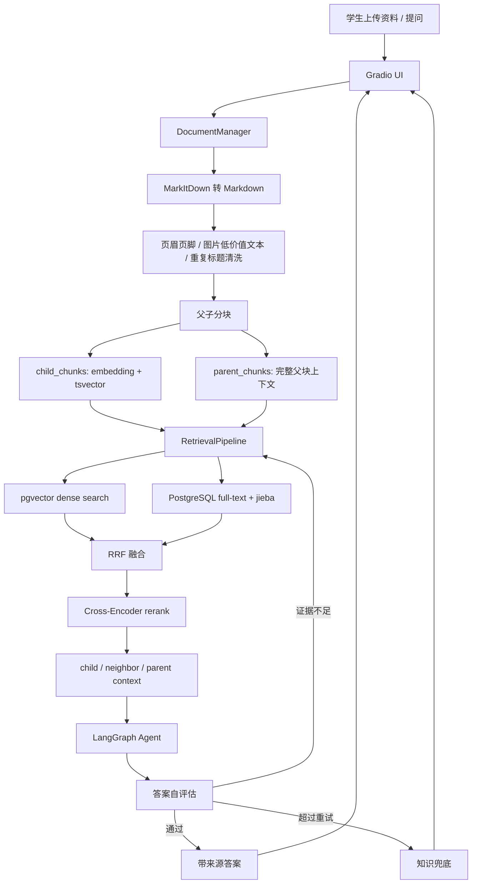
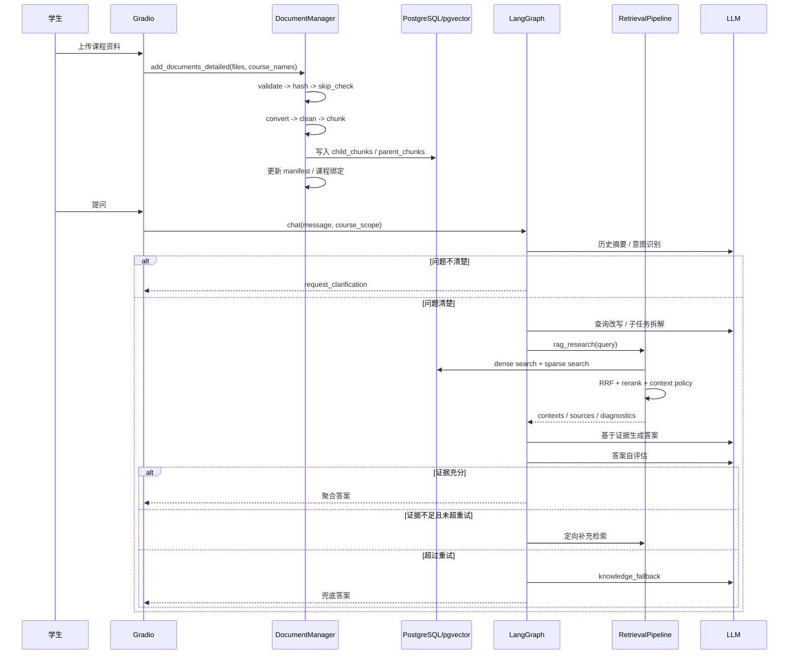

# Agentic RAG 期末复习助手项目深挖笔记

面试定位：AI 应用工程岗
材料目标：把项目讲成一个能落地的 AI 复习助手，而不是技术名词清单。
核心口径：资料摄取、混合检索、Agent 编排、质量评估和兜底策略共同组成闭环。

## 0. 面试总口径

这个项目是一个面向大学生期末复习场景的 Agentic RAG 助手。它解决的不是“问答机器人能不能回答一句话”，而是学生在考前面对课件、教材、笔记、复习资料时，资料来源杂、跨章节概念难关联、时间紧的问题。

用户可以上传 PDF、Markdown、Word、PPT 等资料，系统统一转成 Markdown，清洗页眉页脚等噪声，再构建课程知识库。提问时，系统通过 Dense Vector + PostgreSQL 全文检索的 RRF 混合召回和 Cross-Encoder rerank 找证据，再由 LangGraph 编排多轮追问、查询改写、任务拆解、工具调用、答案聚合和答案自评估，最后给出带来源约束的复习答案。

面试时不要说成“我用了 LangGraph、pgvector、RAGAS”。更好的说法是：**我围绕复习助手的真实使用链路做了三个关键闭环：资料入库闭环、检索证据闭环、答案质量闭环。**

## 1. 一句话项目介绍

### 30 秒版本

我做的是一个基于 Agentic RAG 的大学生期末复习助手。它支持上传 PDF、Word、PPT、Markdown 等课程资料，自动构建课程知识库；学生提问后，系统会做意图识别、查询改写、混合检索、rerank 和答案自评估，最后返回带证据来源的复习答案。相比普通 RAG，它不是简单“检索一次就回答”，而是通过 LangGraph 把澄清追问、子任务拆解、补充检索和兜底策略做成了一个可控工作流。

### 1 分钟版本

这个项目面向大学生期末复习，主要解决三个痛点：资料多且格式杂、跨章节概念不好串联、考前时间紧。我的设计是先把各种资料通过 MarkItDown 统一转换成 Markdown，再做页眉页脚清洗和父子分块，子块用于精准召回，父块或邻近块用于补全上下文。检索侧使用 PostgreSQL/pgvector 做向量检索，用 PostgreSQL 全文检索配合 jieba 分词做稀疏检索，再用 RRF 融合和 Cross-Encoder 二次排序。Agent 侧用 LangGraph 编排会话摘要、意图识别、查询改写、任务拆解、工具调用、答案聚合和答案自评估。这样系统既能处理学生的模糊问题，也能在证据不足时触发补充检索或知识兜底，降低幻觉风险。

### 3 分钟版本

项目从用户链路看分三段。

第一段是资料入库。用户在 Gradio 页面上传 PDF、Word、PPT、Markdown 等资料，并绑定课程。后端用 `DocumentManager.add_documents_detailed` 作为摄取入口，对文件做合法性校验、哈希去重、格式转换、清洗、分块、向量写入、父块写入、manifest 记录和课程绑定。这里的重点不是单纯把文件读进去，而是要保证重复上传可跳过、索引状态可追踪、删除文档时向量、父块、manifest 和课程绑定都能清理。

第二段是检索。系统用父子分块结构：父块按 Markdown 标题和页面边界组织，保留完整语义；子块从父块派生，粒度更细，适合召回。查询时先在 child_chunks 上做 dense 和 sparse 检索，dense 用 pgvector cosine distance，sparse 用 PostgreSQL `ts_rank` 和 jieba 分词，之后用 RRF 把两个排序列表融合，再用 Cross-Encoder rerank。最后根据问题类型选择返回 child、neighbor child 或 parent context，避免所有问题都粗暴塞整段父块。

第三段是 Agent 编排和质量控制。LangGraph 负责状态机和分支：先摘要历史、识别意图，必要时通过 `interrupt_before=["request_clarification"]` 暂停等待用户澄清；问题清楚后进行查询改写和最多 3 个子问题拆解，再并行发送到 task executor。executor 被强制先调用 `rag_research`，拿到证据后生成答案；之后进入答案自评估，如果证据不足或答案不满足要求，就定向补充检索，超过重试上限才进入知识兜底。这个项目的核心价值就在于把 RAG 从一次性检索回答，升级成了可观测、可评估、可降级的复习工作流。

## 2. 整体架构图

## 3. 核心链路时序图

## 4. 核心模块拆解

### 4.1 Gradio 入口和课程范围

**为什么做：** 复习助手需要让学生直接上传资料、选择课程范围、连续对话。对这个项目来说，真实入口是 Gradio，不是 FastAPI。FastAPI 出现在依赖里不等于业务路由已经落地。

**怎么做：**

- `create_gradio_ui()` 创建 Documents 和 Chat 两个 tab。
- Documents tab 调用 `upload_handler()`，再进入 `doc_manager.add_documents_detailed(...)`。
- Chat tab 提供 `Course scope` 下拉框，调用 `chat_interface.chat(msg, hist, course_name)`。

**关键代码/证据：**

- `project/ui/gradio_app.py:7` 创建 UI。
- `project/ui/gradio_app.py:26` 上传 handler。
- `project/ui/gradio_app.py:30` 调用 `add_documents_detailed`。
- `project/ui/gradio_app.py:136` Chat tab。
- `project/ui/gradio_app.py:137` 课程范围下拉框。
- `project/ui/gradio_app.py:151` 绑定 `Gradio ChatInterface`。

**做错会怎样：**

- 如果面试时说“我用 FastAPI 提供接口”，面试官追代码路由会露馅。
- 如果不讲课程范围，项目就像普通文档问答，体现不出期末复习场景。

**怎么优化：**

- 增加课程、章节、知识点三级筛选。
- 为每次回答展示证据卡片、页码、章节路径和置信度。
- 后续如果要做服务化，再补 FastAPI API 层和鉴权。

### 4.2 文档摄取流水线

**为什么做：** 学生资料格式混乱，同一门课可能有 PDF 课件、Word 笔记、PPT、Markdown。摄取链路必须统一格式、去重、记录状态，否则知识库维护成本会很高。

**怎么做：**

- `config.SUPPORTED_DOCUMENT_EXTENSIONS` 支持 `.pdf,.md,.docx,.pptx`。
- `convert_document_to_markdown()` 对非 Markdown 文件调用 MarkItDown 转换。
- `DocumentManager.add_documents_detailed()` 逐个处理文件并返回 added/skipped/failed 统计。
- `_process_document()` 串起 validate、hash、skip_check、convert/clean/chunk、delete_old、write_vector、write_parent、manifest、course_bind。

**关键代码/证据：**

- `project/config.py:103` 文档转换配置。
- `project/config.py:105` 支持扩展名。
- `project/ingestion/conversion.py:42` 调用 MarkItDown。
- `project/ingestion/conversion.py:50` 统一转换入口。
- `project/ingestion/document_manager.py:56` 结构化摄取入口。
- `project/ingestion/document_manager.py:173` 单文档处理主流程。
- `project/ingestion/document_manager.py:181` 文件哈希。
- `project/ingestion/document_manager.py:184` skip check。
- `project/ingestion/document_manager.py:203` 构建 ingestion document。
- `project/ingestion/document_manager.py:204` 清洗。
- `project/ingestion/document_manager.py:205` 分块。
- `project/ingestion/document_manager.py:207` 写子块向量。
- `project/ingestion/document_manager.py:208` 写父块。
- `project/ingestion/document_manager.py:215` 保存 manifest。
- `project/ingestion/document_manager.py:216` 课程绑定。

**做错会怎样：**

- 没有文件哈希和 skip check，重复上传会重复入库，检索结果被重复内容污染。
- 没有 stage 结果，摄取失败后不知道卡在转换、清洗、分块还是写库。
- 删除文档时只删向量、不删父块或 manifest，会产生脏索引。

**怎么优化：**

- 上传大文件时做异步任务和进度状态持久化。
- 对转换失败的文件记录可下载错误报告。
- 增加增量重建：只重建发生变化的页或章节。

### 4.3 Markdown 清洗与父子分块

**为什么做：** 课件转 Markdown 后经常带页眉页脚、页码、重复标题、低价值图片文字。直接 embedding 会让召回被噪声干扰。分块也不能只按固定长度切，因为复习问题经常需要完整概念上下文。

**怎么做：**

- 先按页面解析并清洗，再按 Markdown 标题切父块。
- 小父块合并，大父块再拆分，控制上下文规模。
- 父块保留章节级语义，子块用滑动窗口从父块派生，用于精准召回。
- parent id 绑定起始页和页内序号，降低局部重建导致 ID 漂移的风险。

**关键代码/证据：**

- `project/config.py:80` 子块大小 500、overlap 100。
- `project/config.py:83` 父块最小 2000、最大 4000。
- `project/config.py:91` Markdown 清洗开关。
- `project/ingestion/chunking.py:13` Markdown header splitter。
- `project/ingestion/chunking.py:17` child splitter。
- `project/ingestion/chunking.py:59` page-aware parent grouping。
- `project/ingestion/chunking.py:67` 调用 `clean_markdown_text`。
- `project/ingestion/chunking.py:131` 写清洗后 Markdown、日志和 diff。
- `project/ingestion/chunking.py:151` 小父块合并。
- `project/ingestion/chunking.py:178` 大父块拆分。
- `project/ingestion/chunking.py:243` 父块生成子块。
- `project/ingestion/chunking.py:253` parent id 由页码和页内序号生成。
- `project/ingestion/chunking.py:267` 从父块切子块。

**做错会怎样：**

- 分块太小：召回可能精准，但答案缺上下文，跨章节解释容易断裂。
- 分块太大：embedding 语义被稀释，检索不准，rerank 成本也高。
- 父子 ID 不稳定：增量重建后旧检索结果和父块映射容易错位。

**怎么优化：**

- 按课程材料类型自适应 chunk size，比如 PPT 小页、教材长章分别处理。
- 引入章节目录树，让父块天然挂在课程结构上。
- 对图片和公式做更强的多模态解析，尤其适合课件场景。

### 4.4 PostgreSQL/pgvector 存储与混合检索

**为什么做：** 期末资料里既有语义型问题，也有关键词、公式、术语型问题。只靠向量检索容易漏掉精确术语，只靠全文检索又不擅长语义改写后的问题。

**怎么做：**

- child chunks 写入 PostgreSQL 表，包含 `embedding` 和 `content_tsv`。
- dense search 使用 pgvector cosine distance。
- sparse search 使用 PostgreSQL `ts_rank`，并在应用层用 jieba 分词生成 `to_tsquery`。
- RRF 将 dense 和 sparse 两个排序列表融合。

**关键代码/证据：**

- `alembic/versions/001_initial_schema.py:86` 创建 `child_chunks`。
- `alembic/versions/002_bge_zh_embeddings.py` 将 `embedding` 重建为 `Vector(1024)`，匹配 `BAAI/bge-large-zh-v1.5`。
- `alembic/versions/001_initial_schema.py:99` `content_tsv TSVECTOR`。
- `alembic/versions/001_initial_schema.py:104` pgvector HNSW 索引。
- `alembic/versions/001_initial_schema.py:105` `content_tsv` GIN 索引。
- `project/storage/pg_vector_store.py:13` jieba 分词。
- `project/storage/pg_vector_store.py:29` child chunk 入库。
- `project/storage/pg_vector_store.py:52` 写 embedding。
- `project/storage/pg_vector_store.py:53` 写 `content_tsv`。
- `project/storage/pg_vector_store.py:136` dense search。
- `project/storage/pg_vector_store.py:145` cosine score。
- `project/storage/pg_vector_store.py:157` sparse search。
- `project/storage/pg_vector_store.py:165` `ts_rank`。
- `project/storage/pg_vector_store.py:178` RRF search。
- `project/retrieval/fusion.py:22` RRF 实现。
- `project/retrieval/fusion.py:39` RRF 分数公式：`1 / (k + rank)`。

**做错会怎样：**

- 只用 dense：术语、缩写、数字、公式命中不稳定。
- 只用 sparse：学生换一种说法提问时召回差。
- 中文不分词直接走 PG simple tsquery：中文长句可能无法形成有效词项。

**怎么优化：**

- 对中文课程资料引入更合适的分词词典和课程术语词表。
- 对 dense/sparse 权重做数据集级调参，而不是固定 RRF 参数。
- 对高频课程资料做查询缓存和 embedding 缓存。

### 4.5 Cross-Encoder Rerank 与上下文策略

**为什么做：** RRF 解决的是多路召回融合，但融合后的候选仍可能有噪声。Cross-Encoder 能直接判断 query 和候选文本的相关性，适合二次排序。上下文策略则解决“到底给 LLM 子块、邻近块还是父块”的问题。

**怎么做：**

- 先召回较多候选：dense top 50、sparse top 50、RRF top 10；rerank 时最多取 40 个候选，最终返回 5 个。
- `rerank_child_documents()` 只对 child candidates rerank。
- `select_context_policy()` 根据问题类型和命中分布选择 child、neighbor 或 parent。
- 解释类、比较类、关系类问题倾向 parent；事实类问题倾向 child；多个子块命中同一父块时倾向 neighbor。

**关键代码/证据：**

- `project/config.py:44` dense top 50。
- `project/config.py:45` sparse top 50。
- `project/config.py:46` RRF top 10。
- `project/config.py:53` reranker 配置。
- `project/config.py:55` reranker 模型。
- `project/config.py:58` reranker top 40。
- `project/config.py:59` final top 5。
- `project/retrieval/pipeline.py:72` child chunk 检索入口。
- `project/retrieval/pipeline.py:82` RRF 检索。
- `project/retrieval/pipeline.py:114` rerank child documents。
- `project/retrieval/pipeline.py:124` 调用 Cross-Encoder reranker。
- `project/retrieval/pipeline.py:274` context policy。
- `project/retrieval/pipeline.py:287` parent query marker。
- `project/retrieval/pipeline.py:297` 多个子块命中同父块时返回 neighbor。
- `project/retrieval/pipeline.py:299` fact query 返回 child。
- `project/retrieval/pipeline.py:313` 按 policy 生成上下文。
- `project/retrieval/pipeline.py:347` `rag_research` 先召回 child docs。
- `project/retrieval/pipeline.py:353` rerank。
- `project/retrieval/pipeline.py:371` 选择上下文策略。

**做错会怎样：**

- 所有问题都返回父块：上下文很全，但 token 成本高，噪声也多。
- 所有问题都返回子块：事实题不错，但解释题容易缺前因后果。
- rerank 阈值过严：容易把可用证据过滤掉，触发错误兜底。

**怎么优化：**

- 将 context policy 从规则升级为轻量分类器。
- 用离线评测比较 child、neighbor、parent、adaptive 在不同问题类型上的收益。
- 对 rerank 做批处理和缓存，降低延迟。

### 4.6 LangGraph Agent 工作流

**为什么做：** 普通 RAG 一般是“用户问题 -> 检索 -> 生成”，但复习场景经常有模糊问题、追问、跨章节问题和证据不足问题。Agent 工作流的价值是把这些不确定性变成明确状态和分支。

**怎么做：**

- 主图：`summarize_history -> recognize_intent -> rewrite_query/request_clarification/chitchat -> plan_rag_tasks -> task_executor -> aggregate_answers`。
- 子图：`task_executor -> tools -> task_executor -> collect_answer -> evaluate_answer`，不满足则补充检索或知识兜底。
- `route_after_task_planning()` 使用 LangGraph `Send` 把多个子问题发送到 `task_executor`。
- 编译时设置 `interrupt_before=["request_clarification"]`，让澄清问题可以暂停给用户。

**关键代码/证据：**

- `project/rag_agent/graph.py:10` 创建 task executor 子图。
- `project/rag_agent/graph.py:15` 子图 StateGraph。
- `project/rag_agent/graph.py:16` task executor 节点。
- `project/rag_agent/graph.py:17` ToolNode。
- `project/rag_agent/graph.py:21` evaluate_answer 节点。
- `project/rag_agent/graph.py:29` 自评估后的路由。
- `project/rag_agent/graph.py:36` 创建主图。
- `project/rag_agent/graph.py:43` summarize_history。
- `project/rag_agent/graph.py:44` recognize_intent。
- `project/rag_agent/graph.py:45` rewrite_query。
- `project/rag_agent/graph.py:46` request_clarification。
- `project/rag_agent/graph.py:48` plan_rag_tasks。
- `project/rag_agent/graph.py:49` task_executor。
- `project/rag_agent/graph.py:50` aggregate_answers。
- `project/rag_agent/graph.py:58` task planning 条件边。
- `project/rag_agent/graph.py:62` `interrupt_before=["request_clarification"]`。
- `project/rag_agent/edges.py:19` `Send` 并行发送子任务。
- `project/rag_agent/edges.py:37` 工具调用路由。
- `project/rag_agent/edges.py:53` 答案评估后路由。
- `project/rag_agent/nodes/intent.py:71` 意图识别。
- `project/rag_agent/nodes/intent.py:114` 查询改写。
- `project/rag_agent/nodes/intent.py:138` 最多拆 3 个问题。
- `project/rag_agent/nodes/execution.py:21` 强制先调用 `rag_research`。
- `project/rag_agent/nodes/aggregation.py:7` 聚合多个任务答案。

**做错会怎样：**

- 没有澄清：用户问“这个怎么考”时系统可能乱检索。
- 没有任务拆解：跨章节综合题只检索一次，证据覆盖不全。
- 没有状态机：补充检索、兜底、聚合会散落在 prompt 里，难测试。

**怎么优化：**

- 将 InMemorySaver 换成持久化 checkpoint，支持服务重启后恢复会话。
- 增加每个节点的 trace id 和耗时日志。
- 把任务规划结果展示给用户，让复习链路更透明。

### 4.7 答案自评估、补充检索和知识兜底

**为什么做：** RAG 项目最怕幻觉。复习助手尤其不能把没有证据的内容包装成课件结论，所以答案生成后要检查证据是否足够。

**怎么做：**

- `evaluate_answer()` 先检查是否为 knowledge fallback。
- `_retrieval_evidence()` 解析 `rag_research` 工具结果，统计 contexts、gaps、rerank score、evidence_status。
- 如果证据不足，返回一条内部反馈消息，要求下一步用 focused query 补充检索。
- 如果 LLM 自评估认为答案不满意，也生成 missing information 和 suggested queries。
- 路由层限制最大自评估重试次数，超过后进入 knowledge fallback。

**关键代码/证据：**

- `project/rag_agent/nodes/evaluation.py:31` 收集检索证据。
- `project/rag_agent/nodes/evaluation.py:45` 无检索上下文判定 insufficient。
- `project/rag_agent/nodes/evaluation.py:84` 有 contexts 时判定 sufficient。
- `project/rag_agent/nodes/evaluation.py:116` 生成不满意反馈。
- `project/rag_agent/nodes/evaluation.py:138` evaluate_answer。
- `project/rag_agent/nodes/evaluation.py:148` 证据不足时进入补充检索反馈。
- `project/rag_agent/nodes/evaluation.py:161` LLM 自评估。
- `project/rag_agent/nodes/evaluation.py:175` missing information。
- `project/rag_agent/nodes/evaluation.py:177` suggested follow-up searches。
- `project/rag_agent/edges.py:60` 超过评估重试进入 knowledge fallback。
- `project/rag_agent/nodes/execution.py:71` knowledge fallback。

**做错会怎样：**

- 没有证据门控：模型会把常识和课程资料混在一起。
- 没有补充检索：第一次召回失败就直接回答，召回偶然性太强。
- 没有 fallback 标记：用户分不清答案来自知识库还是通用知识。

**怎么优化：**

- 在最终答案里明确显示 `answer_mode` 和是否使用知识库。
- 对证据不足的回答提示用户上传资料或缩小课程范围。
- 把自评估结果纳入离线评测，统计兜底触发率和误触发率。

### 4.8 评测链路

**为什么做：** RAG 项目的指标很容易被问穿。面试时必须能讲清楚样本量、数据集、baseline、指标含义和局限。

**怎么做：**

- 检索评测看 retrieval metrics：MRR、HitRate@K、Recall@K、Precision@K、NDCG。
- 生成评测看 RAGAS：faithfulness、context_precision、context_recall。
- chunking ablation 用相同数据集和相同召回策略隔离分块影响。
- rerank 对比用同一 200 条 CovidQA 样本比较 RRF+rerank 和 RRF no-rerank。

**关键代码/证据：**

- `project/evaluation/README.md` 说明默认 RAGAS 指标和运行方式。
- `runtime/evaluation_reports/eval_runs/run_2026_05_04_211051_agent_graph_rag_research_covidqa_50_ragas/ragas_metrics_summary.csv`：50 条 CovidQA RAGAS。
- `runtime/evaluation_reports/compare_covidqa200_rrf_rerank_vs_no_rerank.md`：200 条 CovidQA rerank 对比。
- `runtime/evaluation_reports/chunking_ablation/run_2026_05_20_185621_chunking_ablation/report.md`：分块消融。
- `runtime/evaluation_reports/chunking_generation_ablation/run_2026_05_21_175414_chunking_generation_ablation/summary.csv`：分块对生成质量的对比。

**做错会怎样：**

- 只说“提升 16%”，但说不清分母、baseline 和样本量。
- 把 50 条样本的 RAGAS 结果说成线上稳定指标。
- 分块实验里没有隔离变量，不能说明是分块策略导致提升。

**怎么优化：**

- 固定测试集，形成每次改动后的 A/B compare report。
- 区分检索指标、生成指标和用户体验指标。
- 对失败样本做 error taxonomy，比如无证据、证据错位、答案不完整、格式错误。

## 5. 指标证据表

| 结论 | 当前证据 | 可讲口径 | 风险 |
|---|---|---|---|
| RAGAS faithfulness 较高 | CovidQA 50 条：`faithfulness=0.935689` | “在 50 条 CovidQA 样本上，RAGAS faithfulness 约 93.6%。” | 50 条样本量有限，不能说线上稳定达到 93.6%。 |
| 上下文召回有基本保障 | CovidQA 50 条：`context_recall=0.791667` | “同一批样本 context recall 约 79.2%，说明多数参考答案所需上下文能被覆盖。” | RAGAS 指标受数据集和 LLM judge 影响。 |
| rerank 对 HitRate@1 有提升 | CovidQA 200 条：`0.565 -> 0.605` | “RRF+rerank 相比 no-rerank，HitRate@1 提升 0.04 个绝对值。” | 不建议直接说“提升 11%”，除非解释清楚计算口径。 |
| rerank 对 MRR 有提升 | CovidQA 200 条：`0.6974 -> 0.7292` | “MRR 提升 0.0318 个绝对值。” | 不要说成大幅提升，实际是小幅但正向。 |
| 父子分块不是全面优于单粒度 | chunking ablation：best single balanced `0.6723`，best parent-child `0.6701` | “父子分块在 MRR、Hit@1、上下文长度等部分指标上有收益，但不是所有指标全面胜出。” | 简历里的“优于单一粒度分块策略”要收敛口径。 |
| generation ablation 对父子分块要保守 | 50 条 generation summary：single 的 judge 指标整体更高，parent-child 的 retrieval context recall 更高 | “父子分块更偏向补足上下文，生成质量还要结合 prompt 和上下文策略调优。” | 不能说父子分块一定提升最终答案质量。 |

## 6. 三个真实难点

### 难点 1：中文全文检索效果差

**问题：** PostgreSQL 的 simple text search 不会天然理解中文词边界。如果直接把中文句子塞进 `to_tsquery`，检索效果会不稳定。

**解决：** 在应用层用 jieba 把 query 和 chunk content 切成词，再拼成 `&` 连接的 tsquery；dense 检索负责语义召回，sparse 检索负责关键词和术语补充，最后用 RRF 融合。

**面试回答：**
我没有把 PostgreSQL 全文检索当成天然中文搜索引擎，而是在应用层先用 jieba 分词，把中文问题转成 PG 能处理的 tsquery。这样做的收益是实现简单，和 PostgreSQL/pgvector 放在一个存储系统里，部署成本低；代价是分词词典和专业术语覆盖会影响效果，后续可以引入课程术语词表或更专业的中文检索方案。

### 难点 2：父子分块和单粒度分块怎么权衡

**问题：** 父子分块听起来高级，但不是所有指标都赢。当前 chunking ablation 里 best single 的 balanced score 略高，parent-child 只在部分指标有优势。

**解决：** 面试时不要说“父子分块全面优于单粒度”。正确口径是：子块用于召回，父块或邻近块用于补充上下文；它改善的是“召回粒度”和“生成上下文”的矛盾，但最终效果取决于问题类型、上下文策略和 token 预算。

**面试回答：**
父子分块不是银弹。我做它的原因是复习场景里很多问题不是一句事实，而是需要一段章节上下文。子块更适合召回，父块更适合解释。实验上它在 MRR、Hit@1 或上下文覆盖上有局部收益，但在 balanced score 上并不总是超过最佳单粒度，所以我会把它描述成一种工程权衡，而不是绝对提升。

### 难点 3：证据不足时如何控制幻觉

**问题：** RAG 系统如果第一次检索不到证据，LLM 仍可能根据常识回答，导致学生误以为答案来自课件。

**解决：** `rag_research` 返回 diagnostics 和 evidence_status；答案生成后进入 `evaluate_answer`，如果没有足够上下文，就生成内部反馈，要求下一轮 focused search；超过重试上限后才走 knowledge fallback，并标记 `used_knowledge_base=False`。

**面试回答：**
我没有只靠 prompt 说“不要幻觉”，而是做了证据门控。工具结果里会返回 contexts、gaps 和 diagnostics，答案生成后再检查证据状态。如果证据不足，系统不会直接把答案返回给用户，而是要求下一轮定向补充检索；实在没有证据才走知识兜底，并且不把它伪装成知识库答案。

## 7. 三个技术取舍

### 取舍 1：为什么 PostgreSQL/pgvector，而不是 Qdrant

**选择：** 当前实现用 PostgreSQL/pgvector 存 child chunks、parent chunks、documents、evaluation results 等数据。

**原因：**

- 复习助手是应用工程项目，不是单独的向量数据库平台。
- 文档元数据、课程结构、评测结果、对话记录都天然适合关系型数据库。
- pgvector 让 dense search、全文检索、元数据过滤、事务删除放在同一个系统里。

**代价：**

- 超大规模向量检索能力和专业向量库相比可能弱一些。
- 需要自己处理 embedding 维度、索引参数、查询性能。

**面试口径：**
我不是说 pgvector 一定比 Qdrant 更强，而是这个项目的数据规模和工程目标更适合先用 PostgreSQL 统一存储。它降低了部署复杂度，方便做课程、文档、chunk、评测结果的一致性管理。

### 取舍 2：为什么 RRF，而不是只用向量检索

**选择：** Dense 和 Sparse 各自召回，再用 RRF 融合。

**原因：**

- 向量检索适合语义问题。
- 稀疏检索适合关键词、术语、公式、数字。
- RRF 不要求两个检索器分数同尺度，只依赖排名，更稳定。

**代价：**

- 多跑一路检索，延迟和实现复杂度增加。
- RRF 参数和 top_k 需要结合评测调优。

**面试口径：**
RRF 的好处是不用把 cosine score 和 ts_rank 做强行归一化，只看各自排名。对课程资料这种既有语义问题又有术语问题的场景，比单一路向量召回更稳。

### 取舍 3：为什么 LangGraph 状态机，而不是普通 Chain

**选择：** 用 LangGraph 表达主流程和子任务执行流程。

**原因：**

- 复习问答存在分支：澄清、闲聊、RAG 问答、追问。
- 存在循环：答案不满意 -> 补充检索 -> 重新回答。
- 存在并行：一个复杂问题可以拆成多个子问题。
- 这些逻辑用普通 chain 会变成 prompt 和 if/else 混杂。

**代价：**

- 状态字段、路由和节点更多，调试成本更高。
- 如果没有良好日志，图执行问题不容易定位。

**面试口径：**
LangGraph 不是为了炫技，而是因为这个项目有明确的状态和分支。澄清、查询改写、任务拆解、工具调用、答案评估和兜底都不是线性链路，用图更容易控制和测试。

## 8. 三个优化方向

### 性能方向

- 给 embedding、dense/sparse 检索结果、rerank 结果做缓存。
- rerank 做 batch 化，避免每个问题重复初始化或逐条推理。
- 对 context policy 加 token budget，事实题少给上下文，解释题才扩父块。

### 架构方向

- 把 `InMemorySaver` 替换成持久化 checkpoint，支持服务重启后恢复会话。
- 把摄取任务做成队列，支持后台索引、失败重试、进度查询。
- 把评测流水线接入 CI 或 release checklist，每次检索策略变化都生成 compare report。

### 用户体验方向

- 做章节级复习计划和知识薄弱点总结。
- 将答案引用展示为“课程 -> 章节 -> 页码 -> 原文片段”。
- 增加错题本、考点卡片、跨章节概念图。

## 9. 高频追问与回答

### Q1：为什么这个项目叫 Agentic RAG，而不是普通 RAG？

普通 RAG 通常是一次检索、一次生成。这个项目里，检索只是工具调用的一部分。LangGraph 会先做历史摘要和意图识别，问题不清楚会澄清，问题复杂会拆子任务，子任务执行时强制先调用 `rag_research`，答案生成后还会自评估；如果证据不足，会补充检索，超过重试上限才知识兜底。所以它更像一个带状态、分支、循环和工具调用的 RAG 工作流。

### Q2：父子分块到底解决了什么问题？

它解决的是“召回粒度”和“生成上下文”的矛盾。子块更短，更适合 embedding 和精确召回；父块更完整，更适合让 LLM 理解章节上下文。我的实现是先召回子块，再根据 parent_id 找父块或邻近块补上下文。

### Q3：当前实验能证明父子分块全面优于单粒度吗？

不能这么说。当前报告里 best single 的 balanced score 略高于 best parent-child，但 parent-child 在部分指标上有收益，比如 MRR、Hit@1 或上下文长度控制。面试时我会说：父子分块是为了解决复习解释类问题的上下文完整性，不会把它包装成所有指标全面胜出。

### Q4：RRF 的公式是什么？为什么适合融合 dense 和 sparse？

RRF 对每个候选文档累加 `1 / (k + rank)`。它不依赖 dense score 和 sparse score 的数值尺度，只看各自排序名次，所以适合融合 cosine distance 排序和 ts_rank 排序。

### Q5：jieba 在这里解决了什么问题？

PostgreSQL simple full-text search 对中文词边界支持不足。jieba 在应用层把中文问题和文本切成词，再构造 tsquery，让 PG 的 `ts_rank` 至少能基于中文词项工作。它不是最完美的中文搜索方案，但部署简单，和 PostgreSQL/pgvector 架构一致。

### Q6：Cross-Encoder rerank 放在哪一步？代价是什么？

它放在 RRF 融合之后、上下文扩展之前。先用 dense/sparse/RRF 召回候选，再对候选做 query-document 相关性重排。代价是推理更慢，尤其候选多时会增加延迟，所以配置里限制了 reranker top_n 和 final top_k。

### Q7：LangGraph 每个节点做什么？

主图负责全局流程：`summarize_history` 压缩历史，`recognize_intent` 判断问答/澄清/闲聊/追问，`rewrite_query` 改写并拆分问题，`plan_rag_tasks` 生成任务，`task_executor` 执行检索问答，`aggregate_answers` 聚合结果。子图负责单个任务：先调用工具检索，再生成答案，再自评估，不满意就回到执行器补充检索。

### Q8：`interrupt_before` 在人机澄清里怎么发挥作用？

图编译时设置了 `interrupt_before=["request_clarification"]`。当意图识别或查询改写认为问题不清楚时，图会在澄清节点前暂停，把澄清问题交给用户，而不是继续乱检索。这能让模糊问题先被补充约束。

### Q9：答案自评估失败后系统怎么走？

如果证据不足或 LLM 判断答案不满意，`evaluate_answer` 会生成内部反馈，包含 critique、missing information 和 suggested follow-up searches。路由会把流程送回 `task_executor`，让它用 focused query 再调用 `rag_research`。超过最大重试次数后进入 `knowledge_fallback`。

### Q10：什么时候知识兜底？

两类情况会兜底：一是检索证据不足且重试耗尽；二是工具调用或迭代次数达到上限。兜底答案会标记为 `knowledge_fallback`，并且 `used_knowledge_base=False`，避免把通用知识伪装成课程资料结论。

### Q11：RAGAS 指标怎么计算？样本量多少？

当前稳定默认指标是 faithfulness、context_precision、context_recall。仓库里有一份 CovidQA 50 条样本的 RAGAS 报告，faithfulness 约 0.936，context_recall 约 0.792。这个结果可以说明样本集上的生成忠实度和上下文覆盖情况，但不能说线上所有课程都稳定达到这个数。

### Q12：如果资料很多、并发很多、索引变大，瓶颈在哪里？

主要瓶颈有四个：上传后的转换和分块耗时、embedding 写入耗时、dense/sparse 检索延迟、Cross-Encoder rerank 延迟。优化顺序一般是先异步化摄取任务，再做缓存和批处理，最后根据数据规模调 pgvector 索引参数或拆出专门向量库。

### Q13：为什么不用纯向量检索？

课程资料里有大量术语、数字、缩写和公式。纯向量检索对语义相似问题好，但对精确词项不一定稳定。混合检索可以让 dense 处理语义，sparse 补关键词，RRF 统一融合排名。

### Q14：怎么证明不是 prompt 工程堆出来的？

可以从代码链路证明：摄取链路有结构化 stage 和 manifest；检索链路有 dense/sparse/RRF/rerank/context policy；Agent 链路有状态图、工具调用、评估路由和兜底；评测链路有 retrieval metrics 和 RAGAS 报告。它不是只靠一个大 prompt。

### Q15：项目里 LangChain 和 LangGraph 分别起什么作用？

LangGraph 负责工作流编排、节点、状态、条件边和 `Send` 并行任务。LangChain 更多是组件层，比如 `Document`、message classes、tool 装饰器、文本切分器、embedding/model wrapper。面试时要分清楚：LangGraph 是编排层，LangChain 是组件库，内部工具调用有 ReAct-style 行为，但不是纯 ReAct 架构。

## 10. 简历 bullet 对照表

| 简历描述 | 当前支持情况 | 证据位置 | 面试建议 |
|---|---|---|---|
| 多格式文档摄取，MarkItDown 转 Markdown | 支持 | `project/ingestion/conversion.py:42`、`project/config.py:105` | 可以讲。 |
| 页眉页脚自动清洗 | 支持 | `project/config.py:91`、`project/ingestion/chunking.py:67` | 可以讲，但要说“保守清洗”。 |
| 文件哈希去重与索引状态追踪 | 支持 | `project/ingestion/document_manager.py:181`、`:184`、`:215` | 可以讲。 |
| 父子分块检索架构 | 支持 | `project/ingestion/chunking.py:243`、`project/retrieval/pipeline.py:347` | 可以讲。 |
| 父子分块优于单一粒度 | 需要保守 | `runtime/evaluation_reports/chunking_ablation/.../report.md` | 改成“在部分指标/场景有收益”。 |
| Dense + 全文检索 RRF 混合检索 | 支持 | `project/storage/pg_vector_store.py:136`、`:157`、`:178`、`project/retrieval/fusion.py:22` | 可以讲。 |
| pgvector HNSW | 支持 | `alembic/versions/001_initial_schema.py:104` | 可以讲。 |
| jieba 应用层分词 | 支持 | `project/storage/pg_vector_store.py:13` | 可以讲。 |
| Cross-Encoder rerank | 支持 | `project/config.py:53`、`project/retrieval/pipeline.py:114` | 可以讲。 |
| MRR 提升 16%、HitRate@1 提升 11% | 当前证据不匹配 | `runtime/evaluation_reports/compare_covidqa200_rrf_rerank_vs_no_rerank.md` | 改成 MRR +0.0318、HitRate@1 +0.04，或补充计算说明。 |
| LangGraph 多节点 Agent 工作流 | 支持 | `project/rag_agent/graph.py:36` | 可以讲。 |
| interrupt_before 澄清追问 | 支持 | `project/rag_agent/graph.py:62` | 可以讲。 |
| 答案自评估、补充检索、知识兜底 | 支持 | `project/rag_agent/nodes/evaluation.py:138`、`project/rag_agent/edges.py:53` | 可以讲。 |
| RAGAS faithfulness 89%、context recall 80% | 有更精确证据但需限定范围 | CovidQA 50 条：`0.935689`、`0.791667` | 不要泛化成线上指标。 |

## 11. 最后背诵版

这个项目我会按三条主线讲。

第一条是资料入库。我解决的是课程资料格式杂的问题，用 MarkItDown 统一转 Markdown，再做保守清洗、父子分块、哈希去重、manifest 状态追踪和课程绑定。

第二条是检索质量。我没有只做向量检索，而是用 pgvector 做 dense search，用 PostgreSQL 全文检索配合 jieba 做 sparse search，再用 RRF 融合和 Cross-Encoder rerank。子块负责召回，父块或邻近块负责补上下文。

第三条是 Agent 工作流。我用 LangGraph 编排历史摘要、意图识别、查询改写、澄清追问、任务拆解、工具调用、答案聚合和答案自评估。证据不足时不会直接回答，而是补充检索；超过重试才进入知识兜底。

三个难点是中文检索、父子分块权衡、幻觉控制。三个取舍是 PostgreSQL/pgvector vs Qdrant、RRF vs 纯向量、LangGraph 状态机 vs 普通 chain。三个优化方向是性能缓存和批处理、持久化 checkpoint 和任务队列、复习计划和知识薄弱点分析。

最重要的是，指标口径要保守：当前报告能支撑的是具体数据集和样本量下的结果，不要把局部实验说成通用结论。
